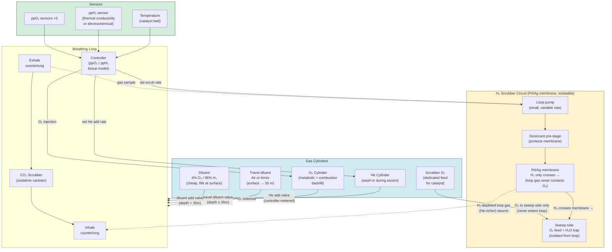
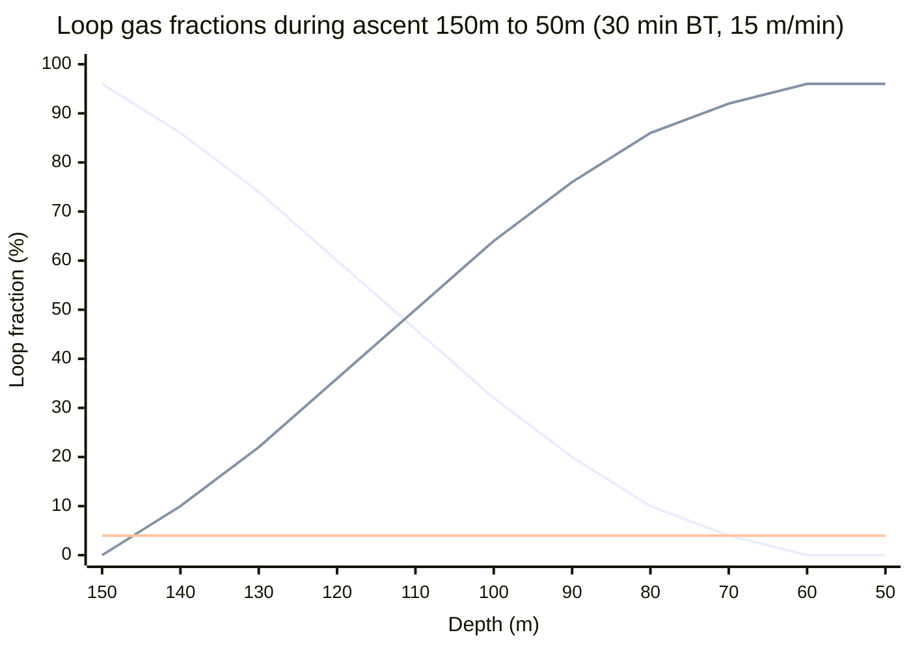
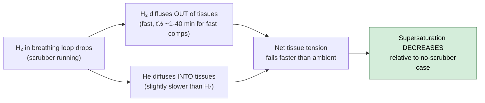
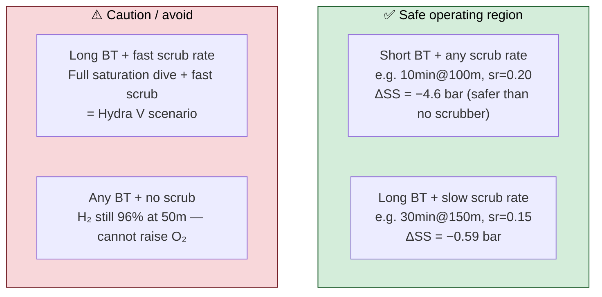

# Catalytic Hydrogen Rebreather (CHR): Concept Proposal

> **Status:** Concept / Feasibility Analysis  
> **Date:** June 2026  
> **Context:** Developed during research into hydrogen diving decompression modelling in the `decodaitengu` project.

---

## Table of Contents

1. [The Problem Being Solved](#1-the-problem-being-solved)
2. [Background: Hydrogen Diving History](#2-background-hydrogen-diving-history)
3. [The Key Constraint: ICD and Combustion](#3-the-key-constraint-icd-and-combustion)
4. [The Proposed Architecture](#4-the-proposed-architecture)
5. [Gas Management Strategy](#5-gas-management-strategy)
6. [Feasibility Analysis: ICD and Scrubber Rate](#6-feasibility-analysis-icd-and-scrubber-rate)
7. [Representative Dive Profiles](#7-representative-dive-profiles)
8. [Engineering Challenges](#8-engineering-challenges)
9. [Prior Art](#9-prior-art)
10. [Open Questions](#10-open-questions)
11. [References](#11-references)

---

## 1. The Problem Being Solved

Deep trimix diving beyond ~150 m runs into two hard physiological walls:

- **HPNS (High Pressure Nervous Syndrome):** caused by helium at high partial pressure. Manifests as tremors, cognitive impairment, nausea. Onset is depth- and rate-dependent; significant above ~150 msw.
- **Narcosis:** nitrogen (and to a lesser extent helium) have narcotic effects that compound with depth.

Hydrogen has long been known to address both: it produces minimal HPNS, has a slight narcotic effect that actually buffers against HPNS, and has the lowest molecular weight of any gas, giving excellent density characteristics at depth.

The obstacle is **combustion risk**: H₂ in air is flammable above ~4% by volume, and explosive above ~18%. This caps the O₂ fraction in any H₂-containing breathing mix at ~4% (by volume). At depth, 4% O₂ gives adequate ppO₂. As the diver ascends, that same 4% fraction becomes hypoxic — at the surface, 4% O₂ = 0.041 bar ppO₂, well below the 0.18 bar hypoxia floor.

The conventional solution is a **hard gas switch** from the H₂ mix to heliox or trimix on ascent. COMEX's experience (Hydra V, 1983) showed that this switch, done abruptly, reliably causes decompression sickness via **isobaric counterdiffusion (ICD)**.

This proposal describes a rebreather architecture that eliminates the hard switch by using a catalytic H₂ scrubber to **continuously and gradually** replace H₂ with He in the breathing loop, paced to match tissue off-gassing rate.

---

## 2. Background: Hydrogen Diving History

### Key Milestones

| Year | Event | Significance |
|------|-------|--------------|
| 1943 | Arne Zetterström dives to 160 m on hydrox (H₂/O₂) | First documented H₂ dives. Killed on ascent by premature O₂ switch to air (hypoxia) |
| 1975 | Lambertsen & Idicula describe ICD [3] | Formal description of isobaric counterdiffusion mechanism |
| 1977 | D'Aoust et al. animal ICD model [4] | Deep tissue ICD demonstrated in animal experiments |
| 1983 | COMEX Hydra V (~450 msw saturation) [2] | ICD incident: abrupt switch from hydreliox to heliox causes DCS |
| 1988 | COMEX Hydra VIII (500 msw) [1] | Zero DCS: catalytic H₂ removal over 18-day decompression; 6 divers, full recovery |
| 1992 | COMEX patent EP0773880A1 [6] | Staged H₂-to-He substitution method patented |
| 2024 | Pearse Resurgence (Mitchell et al.) [7] | CCR used to deliver helihydrox (3% O₂/59% He/38% H₂) at 200–230 m |

### Why Hydrogen?

```
Gas density at 150m (16 bar):
  Air (79% N2):     ~19 g/L  [extreme breathing resistance]
  Heliox 16/84:     ~5.6 g/L [GUE limit ~6.2 g/L]
  Hydreliox 4/10/86: ~3.8 g/L [well below density limit]
  Hydrox 4/96:       ~2.2 g/L [exceptional]
```

At 150 m, a heliox-based trimix approaches or exceeds the GUE/WKPP gas density limit of 6.2 g/L. Hydrogen, being the lightest gas, dramatically reduces work of breathing at any depth.

### Diffusivity Hierarchy

H₂ diffuses through tissue faster than any other diving gas (aqueous diffusivity data [4]):

```
Diffusivity in aqueous tissue (cm²/s):
  N₂:  2.3 × 10⁻⁵  (baseline)
  He:  3.8 × 10⁻⁵  (1.65× N₂)
  H₂:  5.8 × 10⁻⁵  (2.5× N₂, 1.53× He)
```

This means H₂ loads and unloads tissues ~3.7× faster than N₂ and ~1.53× faster than He. For decompression, the fast loading is a minor concern; the fast unloading is a significant *advantage* — H₂ off-gasses quickly. The danger is ICD on the switch away from H₂.

---

## 3. The Key Constraints: ICD and Combustion

### Isobaric Counterdiffusion

ICD occurs when a diver switches from one inert gas to another at constant depth (isobaric). The faster-diffusing outgoing gas leaves tissues faster than the slower-diffusing incoming gas replaces it, causing a transient net supersaturation — bubbles can form with no ambient pressure change [3,4].

For H₂ diving, the critical switch is **H₂ → He** on ascent:

```
H₂ (fast, leaving) → He (slightly slower, entering)
Net effect: brief window where total tissue tension > ambient pressure
```

Because H₂ is only 1.53× faster than He (not 2.65× as with He→N₂), the H₂→He ICD gradient is *smaller* in magnitude than He→N₂ ICD for technical trimix divers [5]. However, for saturation divers (fully loaded tissues), even a small gradient matters. The Hydra V incident was a saturation dive [2]; bounce dives have much lower total tissue H₂ loading.

> **How long to reach saturation on 4%O₂/96%H₂?** Using ZHL-16C half-times scaled by 1/√2 for H₂: the fastest compartment (t½ = 1.1 min) saturates in ~7 minutes; the slowest (t½ = 216 min) takes ~16 hours to reach 95% and ~24 hours to reach 99%. For practical purposes, a diver is "saturated" in H₂ after roughly 24 hours at depth — similar to helium saturation diving schedules. A 30-minute bounce dive loads the slowest compartments to only ~10%, which is why bounce dive ICD risk is so much lower than saturation.

### The Combustion Constraint

```
H₂ lower flammability limit (LFL): ~4% by volume in air
H₂ lower explosive limit (LEL):   ~18% by volume

Therefore: O₂ fraction in loop must be < ~4% while H₂ is present
```

This creates a **ppO₂ window problem** on ascent:

| Depth | p_amb | ppO₂ at 4% O₂ | Safe for breathing? |
|-------|-------|----------------|---------------------|
| 150 m | 16.0 bar | 0.64 bar | ✓ (good) |
| 100 m | 11.0 bar | 0.44 bar | ✓ (acceptable) |
| 50 m  | 6.0 bar  | 0.24 bar | ⚠️ (marginal — above the absolute 0.18 bar floor, but most CCR practitioners set their working floor at 0.3–0.4 bar due to exertion, cold, and CO₂ loading effects) |
| 30 m  | 4.0 bar  | 0.16 bar | ✗ (hypoxic) |
| 15 m  | 2.5 bar  | 0.10 bar | ✗ (severely hypoxic) |
| 0 m   | 1.0 bar  | 0.04 bar | ✗ (lethal) |

The H₂ **must** be removed from the loop before the diver reaches ~40 m, or the O₂ fraction must be increased — which is only safe once H₂ is below 4% by volume.

### The Classic Solution (and its failure)

COMEX's first approach: switch the diver to heliox at ~250 msw when ascending from saturation. **Hydra V result:** DCS from ICD [2].

COMEX's corrected approach (Hydra VIII): install a palladium catalyst chamber in the habitat atmosphere. H₂ + ½O₂ → H₂O, continuously, over 18 days of decompression, reducing H₂ partial pressure below the ICD-dangerous threshold before the switch [1].

**The insight this proposal builds on:** catalytic removal is a solved problem. It just needs to be miniaturised and integrated into a rebreather.

---

## 4. The Proposed Architecture

### System Overview

The **Catalytic Hydrogen Rebreather (CHR)** is a closed-circuit rebreather with an additional catalytic H₂ oxidation circuit that:

1. Removes H₂ from the breathing loop continuously during ascent
2. Injects He to maintain total loop pressure as H₂ is removed
3. Allows the O₂ controller to gradually increase O₂ fraction as H₂ fraction falls
4. Paces all of the above to stay within ICD-safe tissue loading gradients

### Architecture Diagram



### Key Design Principles

1. **The H₂ scrubber circuit is isolatable.** At depth (bottom phase), it is closed. Scrubbing only begins on ascent, when the controller determines it is safe to start reducing H₂ fraction relative to tissue loading.

2. **He injection is controller-metered.** As H₂ is removed, He is injected to maintain total pressure in the loop. The controller tracks the ratio continuously. 

3. **The scrubber O₂ circuit is isolated from the breathing loop.** Two architectures are possible — and the choice has major safety implications:

   - **Option A — Direct contact catalyst bed** (COMEX habitat approach): Breathing gas passes over a Pd catalyst; O₂ is injected into the same gas stream just before the bed, reacts with H₂, and the scrubbed gas returns to the loop. O₂ is metered stoichiometrically so it is fully consumed before returning. The controller must guarantee no O₂ breakthrough — a safety-critical continuous metering requirement.

   - **Option B — Pd/Ag membrane reactor** *(preferred)*: A palladium-silver alloy membrane is selectively permeable to H₂ only — H₂ dissolves into the Pd lattice on the loop side and diffuses to the sweep side; nothing else crosses. The sweep side carries a small O₂ flow that oxidises the H₂ to water. The breathing loop never contacts the scrubber O₂. Safety analysis reduces to: "does the membrane fail mechanically?" rather than "does O₂ breakthrough?" At 150 m, the driving force is ~15 bar ppH₂ differential — actually *better* than many industrial membrane applications. This is the strongly preferred architecture.

   The membrane approach also addresses the batched-pulse question: because transport through the membrane is rate-limited by H₂ partial pressure and membrane area (not by a valve or pump), the scrubbing rate is inherently continuous and self-limiting — no "gulp" of gas can transfer instantaneously. He injection remains controller-metered to maintain loop pressure as H₂ is removed.

4. **The controller runs a tissue model.** The critical novel element: the controller estimates current tissue H₂ loading using a Haldanean multi-compartment model (similar to a dive computer), and paces the scrubber rate to avoid the breathing-gas ppH₂ dropping faster than tissues can follow. This is the ICD constraint.

5. **O₂ fraction is gated on H₂ fraction.** The controller will not allow O₂ fraction to rise above the combustion threshold until loop H₂ is confirmed below 4%.

---

## 5. Gas Management Strategy

### Phase Diagram

```
Depth (m)   Phase              H₂ loop    O₂ loop   He loop
─────────────────────────────────────────────────────────────
0 → 150     Descent            96%        4%         0%
            (scrubber closed)
150         Bottom             96%        4%         0%
            (scrubber closed)
150 → 50    Fast ascent        96→0%      4%         0→96%
            (scrubber OPEN,
             He injecting,
             O₂ held fixed)
~50m        H₂ < 4% confirmed  0%         4%→rising  96%→falling
            (O₂ control freed)
50 → 0      Standard deco      0%         variable   ~96%
            (normal CCR mode)
```

### Gas Switch Transition Detail



*Three traces: **H₂ fraction** (declining from 96% to 0%), **He fraction** (rising from 0% to 96% as He wash-in replaces H₂), and **O₂ fraction** (held constant at 4% throughout). He + H₂ + O₂ = 100% at all depths. Note: profile is schematic — actual H₂/He transition is non-linear (scrubber rate is in fraction/min, ascent rate is in m/min, so the depth-vs-fraction curve depends on the ratio of these).*


### ppO₂ Safety Window

The rebreather controller must maintain ppO₂ between the **hypoxia floor** and the **CNS toxicity ceiling** (1.6 bar working / 1.4 bar conservative). The absolute physiological floor is 0.18 bar, but most CCR practitioners use 0.3–0.4 bar as a working floor due to exertion, cold stress, and CO₂ loading effects at depth. This proposal uses 0.18 bar as a conservative lower bound to maximise the window for H₂ scrubbing; operational protocols would likely set a higher floor, which would require H₂ to be cleared slightly deeper (before ~60 m rather than ~40 m):

```
At 150m: ppO₂(4% O₂) = 0.64 bar  ← well within window
At 100m: ppO₂(4% O₂) = 0.44 bar  ← acceptable  
At  50m: ppO₂(4% O₂) = 0.24 bar  ← above absolute floor; below CCR working floor
At  40m: ppO₂(4% O₂) = 0.20 bar  ← barely above absolute floor
At  30m: ppO₂(4% O₂) = 0.16 bar  ← HYPOXIC

At 0.3 bar working floor: H₂ must be < 4% before ~75m.
At 0.18 bar absolute floor: H₂ must be < 4% before ~40m.
```

---

## 6. Feasibility Analysis: ICD and Scrubber Rate

### Method

A Haldanean multi-compartment (ZHL-16C [8], 16 compartments) simulation was written in Python to model:

- Tissue H₂ loading during descent and bottom phase
- Loop H₂ fraction declining as scrubber runs at constant rate
- He fraction rising correspondingly  
- Supersaturation (total tissue tension − ambient pressure) at each depth step
- ICD metric: `min[(tissue_H₂ − loop_H₂) − (loop_He − tissue_He)]` across all compartments

H₂ tissue half-times were derived from ZHL-16C He values scaled by `1/√2` (Graham's Law: diffusivity ∝ `1/√M`, so D_H₂/D_He = √(M_He/M_H₂) = √(4/2) = √2).

> ⚠️ **Critical caveat on the ICD-safety conclusions below:** The Graham's Law scaling assumes tissue diffusivity ratios match aqueous diffusivity ratios. This is not established. The 5.8/3.8 (H₂/He) ratio comes from measurements in *water* [4]; the composite lipid/aqueous/membrane tissue that Bühlmann compartments [8] represent could have substantially different H₂:He ratios. The safety conclusion — that scrubbing reduces supersaturation — depends entirely on H₂ clearing tissues faster than He loads them (ratio > 1). If the real tissue half-time ratio is closer to 1:1, the conclusion weakens or reverses. **All ICD-related results in this section should be read as "consistent with these assumed coefficients," not as validated findings.**
>
> Additionally, the ICD metric defined below has no published threshold value — it is a relative comparison only. A negative delta (scrubber case better than no-scrubber) does not mean "safe"; it means "less bad than the baseline." No published H₂-specific ICD threshold exists to determine what value is dangerous.

### Tissue Saturation at End of Bottom Phase

Tissue H₂ loading as a percentage of full saturation at bottom pressure:

| Compartment | H₂ Half-time | 10 min@100m | 20 min@100m | 30 min@100m | 10 min@150m | 20 min@150m | 30 min@150m |
|-------------|--------------|-------------|-------------|-------------|-------------|-------------|-------------|
| 1 (fastest) | 1.1 min | 100% | 100% | 100% | 100% | 100% | 100% |
| 3 | 3.3 min | 93.6% | 99.2% | 99.9% | 94.8% | 99.3% | 99.9% |
| 5 | 7.9 min | 69.0% | 87.0% | 94.6% | 71.9% | 88.3% | 95.1% |
| 7 | 18.9 min | 38.9% | 57.6% | 70.6% | 41.5% | 59.5% | 71.9% |
| 9 | 39.0 min | 21.3% | 34.1% | 44.8% | 23.0% | 35.5% | 46.0% |
| 11 | 63.9 min | 13.6% | 22.5% | 30.4% | 14.8% | 23.5% | 31.4% |
| 13 | 103.4 min | 8.7% | 14.6% | 20.1% | 9.4% | 15.3% | 20.8% |
| 16 (slowest) | 215.7 min | 4.2% | 7.3% | 10.2% | 4.6% | 7.6% | 10.6% |

Key observation: fast compartments (≤5 min H₂ half-time) are fully saturated after even a 10-minute bottom time. The slow compartments are still only 10–20% saturated for a 30-minute bounce dive — this is why bounce diving is far safer than saturation for H₂ ICD risk.

### Required Scrubber Rate to Clear H₂ by 50m

Transit time from bottom to 50 m at 15 m/min:
- **150 m → 50 m:** 6.7 minutes
- **100 m → 50 m:** 3.3 minutes

| Depth | BT | Rate 0.0/min | Rate 0.10/min | Rate 0.15/min | Rate 0.20/min | Rate needed | Ascent window (time available for scrubbing) |
|-------|-----|-------------|--------------|--------------|--------------|-------------|---------|
| 100m | 10 min | 96% FIRE | 28.5% FIRE | 6.0% FIRE | 0.0% ✓ | ~0.20/min | 3.3 min |
| 100m | 20 min | 96% FIRE | 28.5% FIRE | 6.0% FIRE | 0.0% ✓ | ~0.20/min | 3.3 min |
| 100m | 30 min | 96% FIRE | 28.5% FIRE | 6.0% FIRE | 0.0% ✓ | ~0.20/min | 3.3 min |
| 150m | 10 min | 96% FIRE | 0.0% ✓ | 0.0% ✓ | 0.0% ✓ | ~0.10/min | 6.7 min |
| 150m | 20 min | 96% FIRE | 0.0% ✓ | 0.0% ✓ | 0.0% ✓ | ~0.10/min | 6.7 min |
| 150m | 30 min | 96% FIRE | 0.0% ✓ | 0.0% ✓ | 0.0% ✓ | ~0.10/min | 6.7 min |

*FIRE = H₂ still above 4% at 50m, O₂ increase unsafe*

**Important distinction:** The table above answers only one question — "can the scrubber clear the loop in time?" It does *not* answer whether a given scrubber rate is ICD-safe for the tissue loading at that bottom time. Those are separate questions. The loop clearance rate is independent of bottom time; the ICD safety of that rate is not — longer bottom times load slow tissue compartments more heavily, making any given scrubber rate incrementally less safe from an ICD perspective. The ICD analysis in the next section uses a fixed bottom time of 20 min; see the Danger Zone section for bottom-time sensitivity.

### Does the Scrubber Add ICD Risk?

This is the critical question. Results for the worst-case scenario (150 m, 20 min BT):

| Depth | SS without scrubber | SS with scrubber (0.15/min) | Delta SS |
|-------|---------------------|------------------------------|----------|
| 150 m | −0.57 bar | −0.60 bar | −0.03 (better) |
| 120 m | +1.80 bar | +1.54 bar | −0.26 (better) |
| 90 m | +3.82 bar | +3.27 bar | −0.55 (better) |
| 60 m | +5.60 bar | +5.01 bar | −0.59 (better) |

**Under the assumed half-time model, the scrubber consistently *reduces* supersaturation relative to the no-scrubber baseline.** The mechanism: if H₂ clears tissues ~1.41× faster than He loads them, then dropping loop ppH₂ causes a faster fall in tissue H₂ tension than the rise in tissue He tension, so net total tension falls.

However — this conclusion is contingent on the 1/√2 half-time scaling being approximately correct (see the caveat in Method above). If the true H₂:He tissue half-time ratio is closer to 1:1 rather than 1:1.41, the scrubber's delta-SS advantage shrinks toward zero and eventually reverses. The model cannot distinguish between these scenarios without empirical H₂ tissue half-time data.

This is the opposite of the Hydra V scenario because:
- Hydra V: saturation dive (tissues 100% loaded in all compartments, slow and fast)
- Bounce dive: slow compartments are only 10–45% loaded; fast compartments off-gas H₂ within minutes regardless




### The ICD Danger Zone: What to Avoid

The scrubber-is-safe conclusion holds for **bounce dives**. The scenario to avoid is:

- **Starting the scrubber before beginning ascent** (at depth, fully loaded) — all tissue compartments are near equilibrium, so any breathing-gas ppH₂ drop creates a large ICD gradient simultaneously across all compartments, with nowhere for the gas to go.
- **Scrubbing faster than tissue H₂ half-times allow** (especially slow compartments) — fast compartments clear H₂ quickly, but a scrubber running at, say, 1.0 frac/min would drop loop ppH₂ to near zero before the 60–300 min compartments have had a chance to off-gas, creating sustained supersaturation in those tissues.
- **Long bottom times at depth** (>2–3 hours) — this progressively loads even the slowest compartments toward equilibrium, converging toward the saturation diver scenario where any scrubber rate becomes dangerous.



*The key insight (under the assumed model): for bounce dives, more scrubbing appears better — the scrubber's delta-SS is negative, meaning it reduces supersaturation relative to the baseline. The danger zone is saturation or extended dives where slow tissue compartments are fully loaded and the 1.41× diffusivity advantage of H₂ over He may not be sufficient.*

---

## 7. Representative Dive Profiles

### Profile A: 100 m, 30-Minute Bottom Time

| Phase | Duration | Loop gas | ppO₂ |
|-------|----------|----------|------|
| Descent surface → 35 m (travel gas) | 1.75 min | Air (21% O₂ / 79% N₂) | 0.21 → 0.46 bar |
| Switch to H₂ diluent at 35 m | — | Switch: Air → 4% O₂ / 96% H₂ ✓ ICD-safe on descent | 0.46 bar |
| Descent 35 → 100 m | 3.25 min | 4% O₂ / 96% H₂ | 0.46 → 0.44 bar |
| Bottom | 30 min | 4% O₂ / 96% H₂ | 0.44 bar |
| Ascent 100 → 50 m (scrubber on) | 3.3 min | H₂ 96% → <4%, He 0% → >92% | 0.44 → 0.24 bar |
| At 50 m: H₂ confirmed <4% | — | O₂ fraction released | 0.24 bar → rising |
| Deco 50 → 0 m (standard CCR) | ~60–90 min | He/O₂ variable | 1.2–1.4 bar |
| **Total runtime** | **~100–130 min** | | |

> **Descent switch ICD safety:** Switching from air to 4%O₂/96%H₂ at 35 m is physiologically safe from an ICD perspective. Tissues are still near surface N₂ loading (~0.80 bar total tension), while ambient is already 4.6 bar — a −4.2 bar margin. Although H₂ is faster-diffusing than N₂ and loads fast compartments rapidly, the total tissue tension at any point during the continued descent remains far below ambient (which is still *rising* at 20 m/min). Even if the fastest compartment transiently loads H₂ at its maximum rate while still holding surface N₂, the combined tension cannot approach the ambient pressure. Supersaturation on descent is physically impossible with this margin.


Gas requirements (approximate):
- Diluent (4/96): ~3–5 bar of a 3L cylinder for diluent adds
- O₂ (metabolic): standard CCR consumption ~0.5–0.8 L/min = ~50–90L for the dive
- He (wash-in): sufficient to replace ~96% of loop volume as H₂ is removed — loop volume ~10L at STP equivalent, so ~960L He. Note: this covers only the gas composition replacement; additional He is needed to maintain loop pressure as ambient falls during ascent (at 15 m/min over 3–7 min this is a small additional volume, ~50–100L, but should be included in cylinder sizing).
- Scrubber O₂ (dedicated): stoichiometric against H₂ removed — modest, ~50–100L at STP

### Profile B: 150 m, 30-Minute Bottom Time

| Phase | Duration | Loop gas | ppO₂ |
|-------|----------|----------|------|
| Descent surface → 35 m (travel gas) | 1.75 min | Air (21% O₂ / 79% N₂) | 0.21 → 0.46 bar |
| Switch to H₂ diluent at 35 m | — | Switch: Air → 4% O₂ / 96% H₂ ✓ ICD-safe on descent | 0.46 bar |
| Descent 35 → 150 m | 5.75 min | 4% O₂ / 96% H₂ | 0.46 → 0.64 bar |
| Bottom | 30 min | 4% O₂ / 96% H₂ | 0.64 bar |
| Ascent 150 → 50 m (scrubber on) | 6.7 min | H₂ 96% → <4%, He 0% → >92% | 0.64 → 0.24 bar |
| At 50 m: H₂ confirmed <4% | — | O₂ fraction released | 0.24 bar → rising |
| Deco 50 → 0 m (standard CCR) | ~120–180 min | He/O₂ variable | 1.2–1.4 bar |
| **Total runtime** | **~160–220 min** | | |

> **Note on deco obligation:** The 150 m deco times above are rough estimates from standard Bühlmann models with trimix-equivalent parameters. The actual H₂ deco would need validated tables — decodaitengu's H₂ coefficients are experimental. The deco obligation from 150 m/30 min is substantial (multiple hours) regardless of gas mix.

### Deco Gas Strategy After H₂ Phase

Once H₂ is below 4%, the loop transitions to standard CCR operation:

```
50 m → 21 m:   He diluent, ppO₂ 1.2–1.4 bar  (accelerated deco)
21 m → 6 m:    O₂-enriched (50–80%), ppO₂ 1.4 bar
6 m → surface: O₂ breaks, ppO₂ 1.6 bar max
```

This is identical to standard deep trimix CCR procedure once the H₂ phase is complete.

---

## 8. Engineering Challenges

### 8.1 Controller Complexity

The CHR controller must simultaneously manage more variables than any existing CCR:

| Variable | Normal CCR | CHR |
|----------|-----------|-----|
| ppO₂ floor (hypoxia) | ✓ | ✓ + gated on H₂% |
| ppO₂ ceiling (toxicity) | ✓ | ✓ |
| ppCO₂ (CO₂ scrubber) | ✓ | ✓ |
| Total loop pressure | ✓ | ✓ |
| **ppH₂ rate of change (ICD)** | — | **✓ NEW** |
| **ppH₂ absolute level** | — | **✓ NEW** |
| **Tissue H₂ model** | — | **✓ NEW** |
| **He injection rate** | — | **✓ NEW** |
| **Scrubber O₂ feed** | — | **✓ NEW** |

The tissue model running in the controller is the key novel element. The controller needs to solve: *"given current tissue H₂ loading, how fast can I reduce loop ppH₂ without creating a dangerous ICD gradient?"*

This is equivalent to the ICD-constrained scrubber rate calculation in Section 6, running in real time.

### 8.2 Catalytic H₂ Removal: Membrane vs Direct Contact

The reaction in both cases: **H₂ + ½O₂ → H₂O** (Δ = −242 kJ/mol)

| Property | Option A: Direct contact | Option B: Pd/Ag membrane *(preferred)* |
|----------|--------------------------|----------------------------------------|
| O₂ enters breathing loop | Yes — must be stoichiometrically consumed | **No** — O₂ never crosses membrane |
| O₂ breakthrough risk | Real; requires safety-critical metering | Eliminated by physics |
| H₂ sensor needed in loop | Yes, for ICD rate control | Yes, for ICD rate control |
| O₂ sensor in scrubber output | Required | Not needed (scrubber is isolated circuit) |
| Operating temperature | Ambient — no ignition needed | Ambient (Pd absorbs H₂ at room temp) |
| Exothermic heat | In breathing loop | Contained on sweep side — isolated |
| Produces liquid water | In loop — needs condensate trap | On sweep side — isolated |
| Catalyst poisons | S compounds; desiccant pre-stage helps | S compounds; desiccant pre-stage helps |
| Pressure differential | Not required | Required: loop ppH₂ > sweep ppH₂ (easily met at depth) |
| Scrubbing rate control | Pump speed + O₂ valve | Membrane area (passive, continuous, self-limiting) |
| Precedent | COMEX Hydra VIII habitat | Industrial H₂ purification; fuel cell membranes |

**Membrane architecture preferred** for diver safety: the breathing gas and the scrubber O₂ are separated by physics, not by a control system.

### 8.3 H₂ Sensor

A reliable, fast-response, in-loop H₂ sensor is essential. Options:

- **Thermal conductivity sensor:** responds to H₂ and He (both low thermal conductivity relative to N₂/O₂). **Critical calibration challenge:** TC output is ambiguous mid-transition — during the H₂→He scrubbing phase, both gases are present in varying proportions, and both shift the TC reading in the same direction. A sensor calibrated for pure H₂/N₂ mixtures will give incorrect readings in a H₂/He/O₂ mixture. Requires a two-gas compensation algorithm or a second independent sensor to disambiguate.
- **Electrochemical H₂ sensor:** highly specific to H₂, low power, good sensitivity at low concentrations. Less suitable at high H₂ fractions (overranging); may need attenuation or a second range sensor to cover 0–96%.
- **Acoustic gas analyser:** measures gas density acoustically; can distinguish H₂/He/N₂ mixtures by fitting a density model. Most suitable for the mid-transition phase but more complex and power-hungry.

Existing CCR O₂ sensors (galvanic cells) are unaffected by H₂.

### 8.4 H₂ Sensor Failure Modes

If the H₂ sensor fails high (reads more H₂ than present), the controller will continue scrubbing when H₂ is already gone — wastes He, but safe.

If the H₂ sensor fails low (reads less H₂ than present), the controller may allow O₂ fraction to rise while H₂ is still present — combustion risk. **This is the critical failure mode** and requires either redundant sensors or a conservative fallback (hold O₂ at 4% until two sensors agree H₂ < 4%).

### 8.5 Water Management

Each mole of H₂ removed produces 1 mole of H₂O (18 g). Scrubbing the loop from 96% → 0% H₂ in a 10L loop at 16 bar involves:

```
~15.4 bar H₂ removed × 10L = 154 bar·L = ~6.3 mol H₂ → ~6.3 mol H₂O → ~113 mL water
```

113 mL in ~7 minutes is the full capacity of a typical CCR condensate trap. This is not "manageable" without careful design — it is a genuine engineering constraint. Two compounding risks:

1. **Desiccant saturation:** The desiccant pre-stage protecting the membrane also competes with moisture from the CO₂ scrubber canister, which generates its own condensate throughout the dive. A desiccant stage sized for the H₂ scrubbing event alone, without accounting for CO₂ scrubber moisture over a 2–3 hour dive, will arrive at the H₂ scrubbing phase partially saturated.
2. **Membrane flooding:** If the desiccant fails to intercept liquid water, the Pd/Ag membrane can be flooded, catastrophically reducing scrubbing rate mid-ascent — exactly when it is needed most.

**Design requirement:** The desiccant pre-stage must be sized for the total moisture budget of the dive (CO₂ scrubber moisture + H₂ scrubbing water), with significant margin. A separate, isolated condensate trap on the sweep side is also needed for the 113 mL of H₂O product.

### 8.6 Controller Failure and Manual Bailout

The controller failure scenario during the H₂ scrubbing transition (e.g., at H₂ ~50%, He ~46%, O₂ 4%) is the most safety-critical failure mode in the system and is not addressed by any existing CCR bailout protocol.

**The problem:** A mid-transition loop is in a state no standard OC bailout cylinder is designed for:
- Loop is ~50% H₂ — not breathable on open circuit (hypoxic at any useful depth)
- Cannot increase O₂ — H₂ still above combustion limit
- Cannot switch to heliox — abrupt H₂→He gas change is the Hydra V scenario
- Cannot ascend on current loop — controller is managing the ICD-safe scrub rate; manual operation may be faster or slower in unpredictable ways

**Candidate manual bailout procedure (preliminary):**
1. **Isolate the H₂ scrubber circuit** — close the scrubber loop valve. This freezes the current loop composition and stops any further H₂ removal.
2. **Ascend at normal rate** — the current loop composition, whatever it is, will maintain ppO₂ at 4% through the ascent. If H₂ is ~50%, the diver can continue ascending on the existing mix without ICD risk (total tissue tension analysis is the same as the full-H₂ case).
3. **At 35 m, switch to travel diluent** — now breathe air travel gas (which was used on descent). This dilutes the loop H₂ progressively with N₂/O₂, and importantly, raises ppO₂.
4. **Do not attempt O₂ injection while H₂ is present** — until the loop has been sufficiently diluted with travel gas or the diver has surfaced and the loop has been vented.

**Open issue:** This procedure has not been modelled and may produce an ICD event at step 3 depending on tissue loading state. A partial-He loop transitioning to air (N₂) replaces a faster gas with a slower one — the classical bad-direction switch [3,5]. Further analysis required.

**Design implication:** The controller should log its last known loop composition and tissue state to a non-volatile store every 10–30 seconds, so that on failure, the diver or support team can reconstruct the state and determine the safest manual path.

---

No published work describes a fully integrated wearable rebreather with onboard catalytic H₂ scrubbing. The closest:

| Work | Relevance | Gap |
|------|-----------|-----|
| COMEX Hydra VIII (Imbert et al., 1987) [1] | Catalytic H₂ removal from habitat atmosphere | Habitat-scale, not wearable; 18-day saturation, not bounce |
| COMEX patent EP0773880A1 (1996) [6] | Staged H₂→He fractional substitution | Habitat process; no tissue-model rate controller |
| Mitchell et al. 2024 (Pearse Resurgence) [7] | CCR for H₂ delivery at 200–230 m | No onboard scrubbing; H₂ fraction low enough to manage conventionally |
| Zetterström 1940s | Surface-supply H₂ dives | Manual switch to air; no ICD management |

**The apparent novelty** of this architecture lies in combining:
1. Miniaturised catalytic H₂ oxidation in the breathing loop
2. Real-time tissue H₂ model in the controller
3. ICD-rate-limited scrubber pace algorithm
4. Coordinated He injection and O₂ gate

The ICD-rate-limiting constraint — pacing scrubber removal to tissue H₂ half-times rather than physical scrubber capacity — does not appear to be explicitly articulated in the published literature, even though it follows directly from the Hydra V lesson.

---

## 10. Open Questions

### Physiological
- [ ] What is the actual ICD-safe H₂→He gradient threshold for bounce dives? (No published data)
- [ ] Do H₂ ZHL-16C coefficients scaled from He provide accurate decompression tables? (Unvalidated)
- [ ] Is the N₂ trace (for HPNS buffering) worth its ICD complexity on the He wash-in phase?
- [ ] What is the minimum ppO₂ that can be safely maintained during the H₂ phase? (affects scrubber design if the controller needs more margin)

### Engineering
- [ ] Palladium catalyst bed sizing: what volume of catalyst is required for the needed scrubbing rates (~0.10–0.20 H₂ fraction/min in a 10L loop)?
- [ ] Loop pump sizing: what flow rate through the catalyst bed is needed?
- [ ] Catalyst lifetime characterisation in diving gas environments (contaminants, pressure, temperature)
- [ ] Thermal characterisation of the exothermic reaction in a sealed CCR loop at depth
- [ ] H₂ sensor validation at high H₂ fractions and high pressure

### Regulatory / Safety
- [ ] How do existing CCR certification frameworks apply to a novel gas species in the loop?
- [ ] What failure-mode analysis is required for the H₂ sensor fault scenarios?
- [ ] What is the minimum viable redundancy for the catalytic circuit?
- [ ] **What is the safest manual bailout procedure from a partially-scrubbed loop?** (See Section 8.6 for preliminary analysis — the step 3 He→N₂ switch may itself be an ICD risk; this needs to be modelled before any practical dive)

---

## 11. References

| # | Reference | Notes |
|---|-----------|-------|
| [1] | Imbert, Gortan, Fructus, Ciesielski & Gardette (1987). *Hydra 8: Pre-commercial Hydrogen Diving Project.* SUT Subtech proceedings. | Primary COMEX H₂ dive paper; catalytic removal method |
| [2] | Rostain, J.C. (1987). Cited in Hydra V report. | H₂/He ICD incident documentation |
| [3] | Lambertsen & Idicula (1975). *A new gas lesion syndrome in man, induced by 'isobaric gas counterdiffusion'.* J Appl Physiol 39:434–443. | Original ICD description |
| [4] | D'Aoust BG, Swanson HT, Gordon R, Survanshi S, Vann RD, Flynn ET, Lambertsen CJ (1977). Isobaric inert gas counterdiffusion. *Undersea Biomed Res* 4(3):211–220. | Animal model deep tissue ICD |
| [5] | Doolette & Mitchell (2003). *Biophysical basis for inner ear decompression sickness.* J Appl Physiol 94:2145–2150. | Inner ear ICD; switch timing |
| [6] | COMEX patent EP0773880A1 (1996). | Staged H₂→He substitution method |
| [7] | Mitchell SJ et al. (2024). *Case report: use of helihydrox in CCR diving.* Diving and Hyperbaric Medicine. | Most recent CCR H₂ use; Pearse Resurgence 200–230 m |
| [8] | Bühlmann AA (1983). *Decompression — Decompression Sickness.* Springer. | ZHL-16 model basis |

---

## Appendix: Simulation Code

The Python simulation used in Section 6 is available at:

```
decotengu/tools/h2_scrubber_icd.py
```

It models a Haldanean 16-compartment ascent with configurable scrubber rate and produces the supersaturation and ICD metric tables in this document.

Key parameters used:
- H₂ half-times: ZHL-16C [8] He values × `1/√2` (Graham's Law)
- Descent: 20 m/min
- Fast ascent: 15 m/min (150 m or 100 m → 50 m)
- dt: 0.5 min
- Surface pressure: 1.013 bar
- N₂ pre-loading: 0.79 × 1.013 bar (surface air equilibrium)

---

*This document was produced as part of the `decodaitengu` decompression modelling project. All physiological conclusions are theoretical and unvalidated. Do not use for actual dive planning.*
